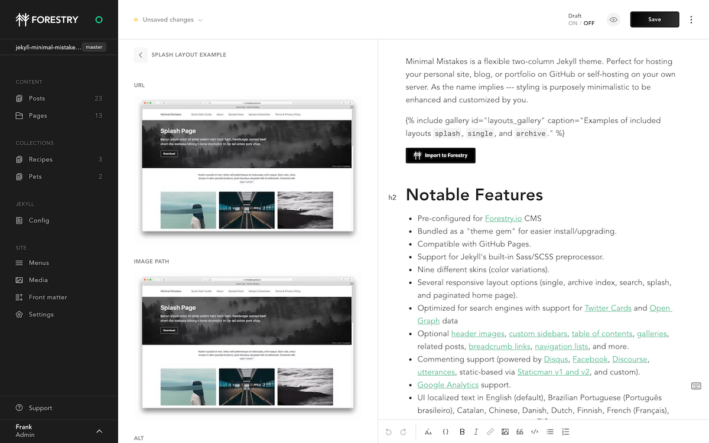

# Jekyll Minimal Mistakes Forestry Starter


## Prerequisites

- Jekyll > 3.8

## Content Management



This project has been pre-configured to work with [Forestry](https://forestry.io), just import your repository ✨. \
Any changes you make will be commited back to the repository.

[](https://app.forestry.io/quick-start?repo=dirtyf/jekyll-minimal-mistakes-forestry&engine=jekyll)

## Deployment and hosting

Import your repository in [Vercel](https://vercel.com) and deploy automatically for free.

[](https://vercel.com/import/git)

## Development

```bash
# Clone your repository
# Go in your project's folder
# Start local server
bundle exec jekyll serve
```

## Customization

Head over the [theme's documentation](https://github.com/mmistakes/minimal-mistakes) to learn how to customize your site.

## [LICENSE](https://github.com/mmistakes/minimal-mistakes/blob/master/LICENSE)
